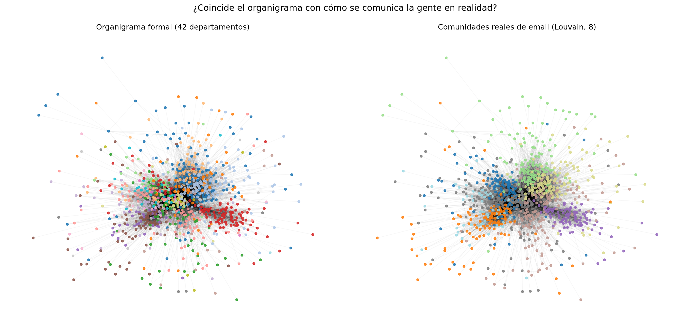

# Organigrama vs. realidad: análisis de redes organizacionales (ONA)

¿Coincide el organigrama de una empresa con cómo se comunica su gente en realidad? Este proyecto responde a esa pregunta con datos reales: la red de emails internos de una institución de investigación europea (**1.005 empleados, 42 departamentos, 25.571 relaciones**).



## Hallazgos principales

1. **La estructura informal es más simple que la formal**: el algoritmo de Louvain detecta solo **8 comunidades reales** de comunicación frente a los 42 departamentos oficiales (NMI = 0,59). Varios departamentos funcionan de facto como un único equipo.
2. **Hay departamentos que trabajan "partidos"**: algunos tienen menos del 50% de sus miembros en su comunidad principal — colaboran más con otras áreas que entre sí.
3. **Un puñado de "brokers" sostiene la comunicación transversal**: un solo empleado conecta 36 de los 42 departamentos. Si se va, la organización lo nota.

## Stack

`Python` · `NetworkX` (Louvain, centralidades) · `pandas` · `scikit-learn` (NMI/ARI) · `matplotlib`

##  Estructura

```
├── organigrama_vs_comunidades.ipynb   # Notebook con el análisis completo narrado
├── src/analysis.py                    # Versión script
├── data/                              # Dataset email-Eu-core (SNAP)
├── figures/                           # Visualizaciones generadas
└── results/                           # Métricas, brokers y cohesión por departamento
```

## Reproducir

```bash
pip install networkx pandas scikit-learn matplotlib
python src/analysis.py
```

##  ¿Para qué sirve esto en una empresa?

Con metadatos de email/Teams/Slack (quién habla con quién, **nunca el contenido**), un análisis ONA permite: validar si los equipos del organigrama existen en la práctica, detectar áreas aisladas o silos, identificar a las personas clave que conectan departamentos (riesgo de fuga, candidatos a coordinación) y medir el impacto de una reorganización o del trabajo en remoto.

>  En entornos reales este análisis requiere anonimización, agregación y cumplimiento de RGPD.

## Fuente de datos

Leskovec et al., [email-Eu-core network](https://snap.stanford.edu/data/email-Eu-core.html), Stanford SNAP.

---
Proyecto de [Yared Gómez](https://github.com/yaredgomezanalyst) · People Analytics & Desarrollo Organizacional
